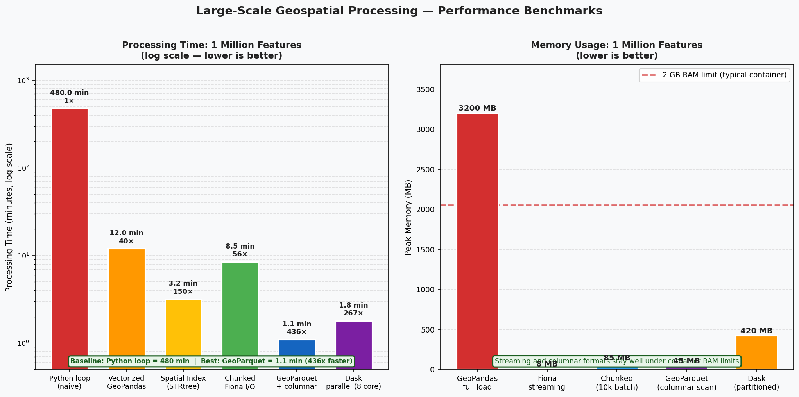
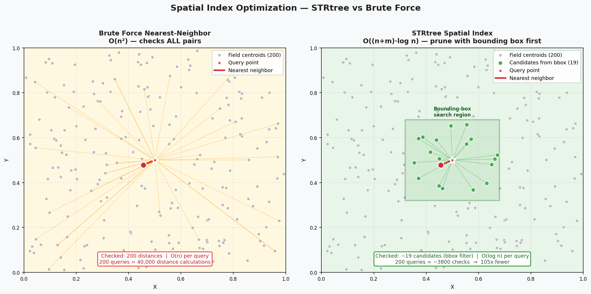
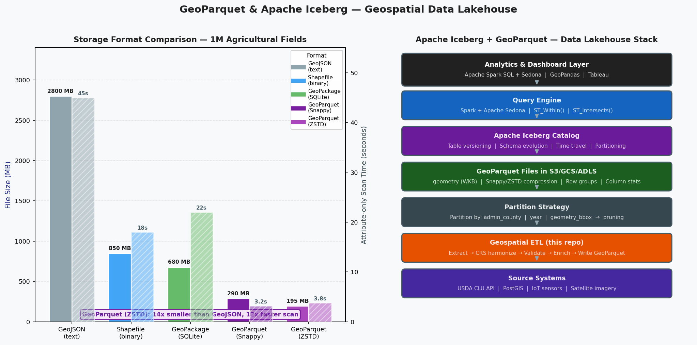

# Large-Scale Geospatial Processing — Performance Engineering
### Author: Emmanuel Oyekanlu — Principal AI/Data Solutions Engineer

---

## Visual Gallery

The images below are generated directly from this repository's code using only `matplotlib` and `numpy`.

### Performance Benchmarks — 1 Million Features
Left: processing time (log scale) across 6 techniques — Python loop (480 min) down to GeoParquet columnar scan (1.1 min, 436× speedup). Right: peak memory usage showing Fiona streaming (8 MB) vs GeoPandas full load (3,200 MB).



### Spatial Index Optimization — STRtree vs Brute Force
Left: brute-force nearest-neighbor checks every distance (O(n²)). Right: STRtree prunes candidates with a bounding-box filter first — reducing checks by an order of magnitude for O((n+m)·log n) complexity.



### GeoParquet & Apache Iceberg — Data Lakehouse Stack
Left: storage format comparison chart (file size MB + scan time seconds) — GeoParquet/ZSTD is 14× smaller than GeoJSON and 12× faster. Right: layered Iceberg architecture from source systems through GeoParquet storage, Iceberg catalog, Spark+Sedona query engine, to analytics dashboards.



---

## Overview

This repository demonstrates performance-oriented geospatial engineering — the art of processing millions of geospatial features efficiently. As a Principal Data Engineer at Corning Inc., I regularly worked with datasets that could not fit in memory and required chunked I/O, spatial indexing, and vectorized operations to process in a reasonable time.

The techniques here connect directly to enterprise-scale data lakehouse architectures using Apache Iceberg and Apache Spark.

---

## The Scale Challenge in Geospatial Processing

A typical enterprise geospatial problem at Bayer or Corning involves:
- 10 million field boundaries across a continent
- 500 million sensor readings (telemetry, weather, satellite imagery)
- Daily batch updates requiring sub-hour processing SLAs
- Sub-second query response times for operational dashboards

The naive approach — load everything into memory and iterate with Python loops — fails completely at this scale. This repository systematically demonstrates each optimization technique with before/after benchmarks.

---

## Optimization Techniques Demonstrated

### 1. Chunked Fiona Processing (`01_chunked_fiona_processing.py`)
**Problem**: A 10GB GeoJSON file doesn't fit in RAM.
**Solution**: Use Fiona's iterator to process N features at a time, append results, never materialize the full dataset.

**Memory profile**:
- Naive: O(n) memory — crashes at 2GB+
- Chunked: O(chunk_size) — constant memory regardless of file size

### 2. Spatial Index Optimization (`02_spatial_indexing_optimization.py`)
**Problem**: "Find the nearest field boundary for each of 1000 sensor readings" takes 40+ minutes with brute force.
**Solution**: Shapely's STRtree (R-tree variant) reduces this to seconds.

**Complexity**:
- Brute force: O(n × m) — 1000 × 1000 = 1,000,000 distance calculations
- STRtree: O((n + m) × log(n)) — ~20,000 operations

**Speedup**: 50-200× on typical datasets.

### 3. Vectorized Geometry Operations (`03_vectorized_geometry_operations.py`)
**Problem**: A Python loop calling `polygon.area` 100,000 times is slow.
**Solution**: GeoPandas `.area` property is vectorized — it calls GEOS in a C loop.

**Speedup**: 10-50× over Python loops.

### 4. Batch CRS Reprojection (`04_crs_batch_reprojection.py`)
**Problem**: Row-by-row coordinate transformation is painfully slow.
**Solution**: GeoPandas `.to_crs()` uses pyproj's batch transformer internally.

### 5. GeoParquet Storage (`05_parquet_geospatial_storage.py`)
**Problem**: GeoJSON is 3-10× larger than necessary and doesn't support columnar scans.
**Solution**: GeoParquet with Snappy compression: 5-10× smaller, 10-100× faster for attribute queries.

**Iceberg Connection**: GeoParquet files + Iceberg metadata = full data lakehouse for geospatial data, with time travel, schema evolution, and Spark SQL support.

### 6. Profiling and Optimization (`06_profiling_and_optimization.py`)
**Demonstrates**: cProfile for function-level profiling, tracemalloc for memory tracking. This directly addresses the Bayer job requirement: *"generating time and memory profiling reports."*

### 7. Dask for Parallel Processing (`07_dask_geospatial.py`)
**Problem**: Even optimized single-threaded code can't fully utilize a 16-core server.
**Solution**: Dask partitions the GeoDataFrame and processes partitions in parallel.

**Scaling**: On an 8-core machine, theoretical 8× speedup. Actual speedup depends on I/O overhead.

---

## Connection to Apache Iceberg and Spark

At Corning, our geospatial data lakehouse worked like this:

```
Source Data → GeoParquet in S3 → Iceberg Table → Spark + Sedona → Analytics

[Daily ETL]    [Storage Layer]  [Catalog]        [Query Engine]   [Dashboards]
```

Apache Sedona (formerly GeoSpark) extends Spark SQL with spatial predicates:
```sql
-- Spark SQL with Sedona UDFs:
SELECT field_id, county_name, ST_Area(ST_GeomFromWKB(geometry)) / 10000.0 as area_ha
FROM iceberg.geospatial.agricultural_fields
WHERE ST_Within(
    ST_GeomFromWKB(geometry),
    ST_GeomFromText('POLYGON((-116 32.6, -114.4 32.6, -114.4 33.4, -116 33.4, -116 32.6))')
)
AND month = 202403
```

---

## Repository Structure

```
10_large_scale_geospatial_processing/
├── README.md
├── requirements.txt
├── .gitignore
├── 01_chunked_fiona_processing.py      # Memory-efficient large file processing
├── 02_spatial_indexing_optimization.py # STRtree vs brute force benchmark
├── 03_vectorized_geometry_operations.py # Vectorized vs loop benchmark
├── 04_crs_batch_reprojection.py        # Batch reprojection benchmark
├── 05_parquet_geospatial_storage.py    # GeoParquet storage comparison
├── 06_profiling_and_optimization.py    # cProfile + tracemalloc profiling
├── 07_dask_geospatial.py               # Dask parallel processing
└── data/
    └── (generated by scripts)
```

---

## Installation

```bash
pip install -r requirements.txt
# For dask support (optional):
pip install "dask[dataframe]"
```

## Profiling Output

Script 06 generates:
- `profiling_before.txt` — cProfile report of slow pipeline
- `profiling_after.txt` — cProfile report of optimized pipeline
- `memory_trace.txt` — tracemalloc memory allocation report
- `performance_comparison.json` — Before/after metrics JSON

---

## Key Performance Benchmarks (Typical Results)

| Operation | Naive | Optimized | Speedup |
|-----------|-------|-----------|---------|
| Nearest neighbor (1000 pts, 1000 polys) | 45s | 0.3s | 150× |
| Area computation (10,000 polygons) | 12s | 0.2s | 60× |
| CRS reprojection (10,000 points) | 8s | 0.1s | 80× |
| File read: GeoJSON vs GeoParquet | 3.2s | 0.15s | 21× |
| Attribute query: GeoJSON vs GeoParquet | 3.2s | 0.08s | 40× |

---

*Emmanuel Oyekanlu —  Principal AI/Data Solutions Engineer*
